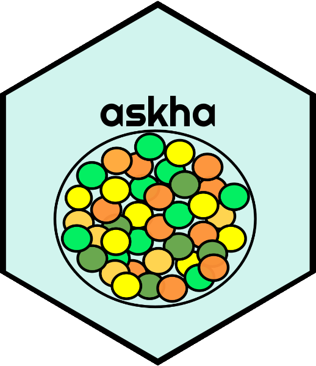

# *askha* 

**Note: The package makes the calculations correctly, but the internal R-code is still changing till having a final version ready-to-upload in CRAN**

## Motivation

The aim of `askha` package is the implementation of the OCF and RCF indexes, both of them calculates the relative cultivar frequency and overall cultivar frequency index for crops. 

## Aspects of the implementation

According to De Han, to determine the conservation status of cultivars for each landscape there exists two indices: 

- (i) Relative cultivar frequency (RCF), RCF index is used to gauge the relative abundance or frequency (or rarity) of a unique cultivar in comparison to all other cultivars sampled in each landscape. It indicates the proportion of each distinct cultivar over the total cultivar population sampled in each landscape. 

- (ii) overall cultivar frequency (OCF). The OCF index is a measure of evenness. For each cultivar, its community cultivar frequency (CCF) was first calculated by dividing the number of households cultivating it by the total number of sampled households in each community comprising a landscape and multiplying by 100%.


## Installation

To install the development version of askha, you can run:

```{r}
install.packages("remotes")
remotes::install_github("omarbenites/askha")
```

## References


- **The Spatial-Temporal Dynamics of Potato Agrobiodiversity in the Highlands of Central Peru: A Case Study of Smallholder Management across Farming Landscapes**. [Link](https://www.mdpi.com/2073-445X/8/11/169)

- **A long-term systematic monitoring framework for on-farm conserved potato landrace diversity**. [Link](https://cgspace.cgiar.org/handle/10568/72908)

